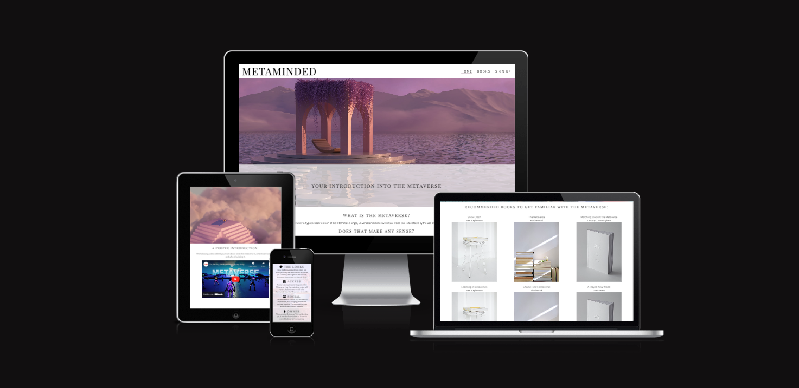

#Milestone Project 1
Welcome USER_NAME,

In this document I will explain the approach and reason behind the website called MetaMinded. The purpose of this website is to give the user an introduction of the Metaverse: a first glance of what it is, and can be. To accomplish this the website includes a definition, an introduction video, recommended books, and a sign up page to get an update whenever there is a new book available. The user in mind is someone that does not know anything about the Metaverse and start learning more about it. This website is responsive and thus can be accessed via desktop, tablet and mobile phone.

The last update to this file was: **September 3, 2022**

## Pictures and live link
The live project can be viewed by clicking this link: https://merelmoehn.github.io/metaminded/

## User Experience (UX)
**User stories (first time, returning, frequent)**
The user stories that are at the base of this website are devided into three categories:

First time users
* As a first time user I want to understand what this website is about.
* As a first time user I want to be able to navigate through the site to see the different content.
* As a first time user I want to be able to learn more about this website, its activities and goals by reviewing its social media.

Returning users
* As a returning user I want to gain more knowledge of the Metaverse at a basic level.
* As a returning user I want to know how I can gain more knowledge about the Metaverse when leaving this website.
* As a returning user I want to know how I can get in touch with the person behind this website to ask questions.

Frequent users
* As a frequent user I want to see if any new books are added to the website by either visiting the website or sign up for updates.

**Design**
The design of the website is kept minimalistic to ensure the focus went to the content and the artistic images to show how the Metaverse can look like. A lot of people might think it will look like a video game, so the purpose of these large and artistic images is to show them differently.

The colors used for the website are black, white, and a darkish purple (#865f7b).

**Features**

* Navigation: this functionality provides the user to navigate through the different site pages. The user gets feedback via underlining and italic font of the current active page.

* Introduction video: this functionality provides the user with a Youtube video that introduces the Metaverse and relevant aspects. The user is in control of the Youtube video.

* Characteristics: this functionality provides the user with an overview of the four most important aspects of the Metaverse.

* Book library: this functionality provides the user with an overview of the recommended books to read when wanting to learn about the Metaverse.

* Sign Up: this functionality gives the user the opportunity to enter his details so he or she can get email updates about new books.

* Contact Links / footer: this functionality gives the user the opportunity to get in contact with the site creator, visit the social media accounts and see the site map.

## Technologies Used
**Languages Used**
* HTML5
* CSS

## Frameworks, Libraries & Programs Used
* Hover.css: I used hover to give the user feedback when hovering over the menu items and buttons.
* Google Fonts: I used Google Fonts to include two types of fonts: Playfair Display and Sources Sans Pro.
* Font Awesome: I used Font Awesome for icons which are used on the Metaverse Characteristic section on index.html.
* Git: I used Git for the version control of my code.
* GitHub: I used GitHub for managing my repositories.
* UnSplash.io: I used Unsplash.io as image library. All images are from the artis Mo.

## Testing
The W3C Markup Validator and W3C CCS Validator Services were used to validate every page of the project to ensure there were no syntax errors in the project.
-> Results CSS validator: [http://jigsaw.w3.org/css-validator/validator$link]
-> Results Markup Validator:

**Testing the User Stories from User Experience (UX) section**

**Bugs found and solved**
* Positioning library: during testing my website I found that my book library was not responsive. That's why I changed it from a table to a Grid, which allowed me to make it responsive.
* Responsiveness iframe: during testing my website I found that the iframe (introduction video) was not responsives. I researched online and found out how to make it responsive. However, then it covered the whole page. I want it to be a max height and width but also to be responsive. That is why I have kept the max height and width in the iframe declaration (in HTML) and put the responsiveness code in the media queries.

## Deployment
**GitHub Pages**
The project was deployed to GitHub Pages using the following steps:
1. I pushed my final code via the terminal after finishing the project.
2. I navigated on GitHub to 'Settings'
3. After Settings I navigated to GitHub Pages
4. There I selected 'Deploy from Branch'
5. Then I selected 'Main/(root)' branch

## Credits
**Code**
* Some of the code is based on the examples of the Love Running Project
* The code for making my iframe responsives I got from StackOverflow [Making iframe Responsive](https://stackoverflow.com/questions/17838607/making-an-iframe-responsive)

**Content**
* The definition of the Metaverse is based on the Metaverse Wikipedia site

**Media**
* All images come from UnSplash.io from the artist Mo.

**Acknowledgements**
* I want to thank the tutors for guiding me especially regarding some positioning challenges
* I thank my mentor for his review and feedback on my project
* I thank my fellow students for providing me with suggestions via Slack
I want to CodeInstitute for the modules that made me capable of writing this code* 
---

Thank you!
